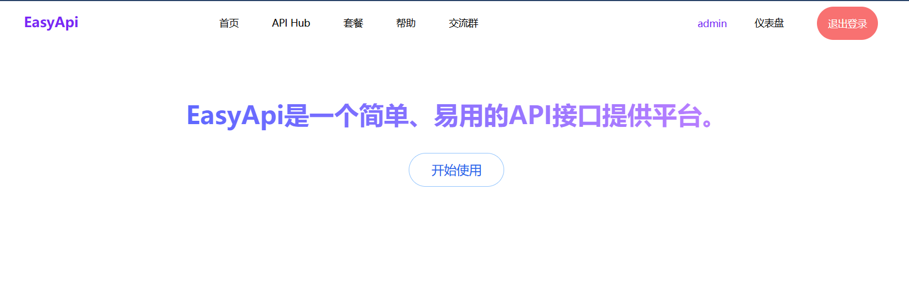
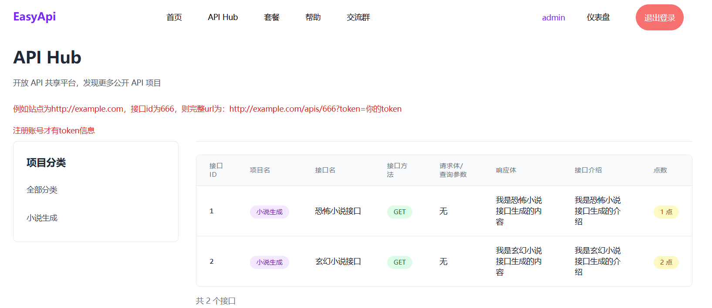
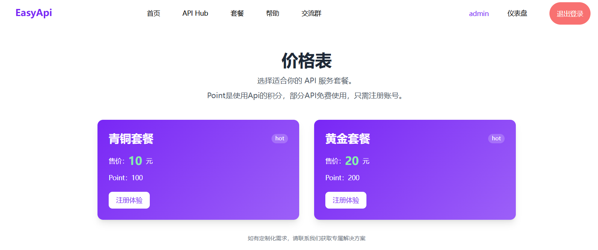
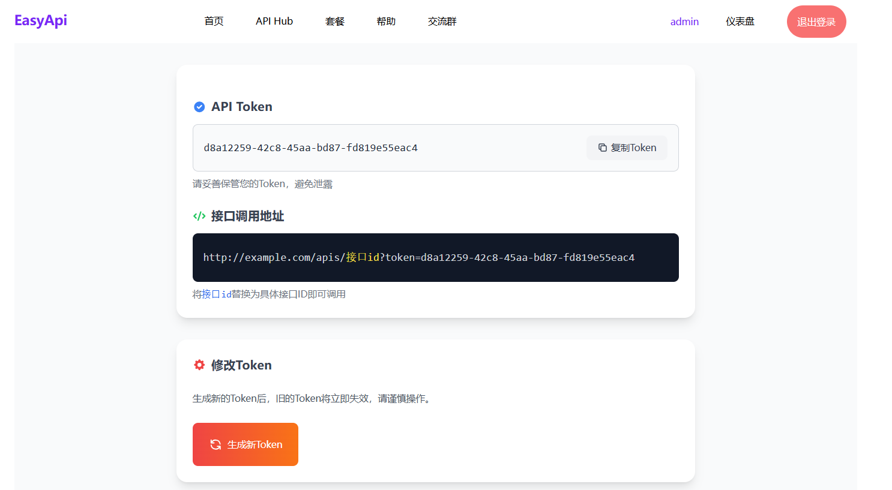
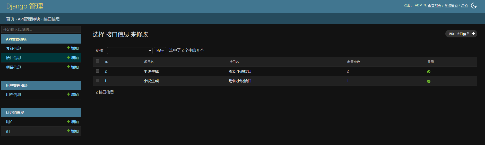

## EasyApi-简易管理接口的面板

> 本项目由django开发，用于创建一个简易管理层面的api接口服务。

首页：



api列表页：



套餐页：



个人中心：




后台：



### 项目介绍：

例如你有个**项目**功能是生成小说，你需要将这个功能提供到互联网上并**希望是一部分人可用**(免费API容易泛滥导致影响成本)，所以需要个管理系统，需要用户注册登录才可用。

每个项目都会有**多个接口**，例如生成恐怖小说是接口a，生成玄幻小说是接口b。每个接口独立设置接口价格、请求方式、响应内容，以及**对应的函数**等。

点数相当于是**计费**用的，每个用户都会有点数，每次访问接口都会**根据接口函数返回的状态码是否为200来决定是否扣除点数**。当接口的函数执行失败，返回了非200状态码则不扣用户的 `点数` 。


内置功能：EasyApi实现了用户登录、注册、后台管理(django后台)、套餐显示、项目与接口的创建、项目与接口的显示/隐藏，支付宝支付功能，页面采用响应式布局。


> `util/apis.py` 文件添加你的自定义脚本 每个脚本需要对接接口id

每个函数都需要返回一个字典，字典中需要包含 `code:整数状态码` ，因为接口的函数有可能执行失败，失败后就不扣除用户的 `点数` 了（优化用户体验）。

例如：

```python
    return data = {
        'code': 200,
        'data':'abcd',
        'msg':'调试成功'
    }
```

### 常规部署

需要提前创建mysql数据库

```shell
cd /home
git clone https://github.com/Rx5557770/EasyApi.git
cd EasyApi
```

克隆本项目后，运行 `pip install -r requirements.txt` 安装依赖

运行 `python -c "import secrets; print(secrets.token_hex(32))"` 获取key。

在项目目录下编写 `.env` 文件 替换 `your_django_secret_key_here` 为刚刚复制的key。

```dotenv
DEBUG=False

SECRET_KEY=<your_secret_key>


#### 网站配置 ####
# 网站名称
WEBSITE_TITLE=EasyApi
# https状态
SECURE_SSL_REDIRECT=True
# 域名/IP
ALLOWED_HOSTS=api.456968.xyz
# 仪表盘-我的页面中显示的接口地址
API_HOST=https://api.456968.xyz
# nginx添加的主机地址 例如 https://api.456968.xyz（后面不要加/），多个用英文,连接  （如果没有域名则注释）
CSRF_TRUSTED_ORIGINS=https://api.456968.xyz


#### 数据库 ####
ENGINE=django.db.backends.mysql
MYSQL_USER=root
MYSQL_ROOT_PASSWORD=<MYSQL_ROOT_PASSWORD>
MYSQL_DATABASE=<MYSQL_DATABASE>
DB_HOST=127.0.0.1
DB_PORT=3306


#### 支付宝配置 ####
# 网关
ZFB_SERVER_URL=<ZFB_SERVER_URL>
# app id
ZFB_APPID=<ZFB_SERVER_URL>
# 商家id
ZFB_SELLER_ID=<ZFB_SERVER_URL>
# 支付宝公钥
ZFB_PUBLIC_KEY=<ZFB_PUBLIC_KEY>
# app私钥
ZFB_APP_PRIVATE_KEY=<ZFB_APP_PRIVATE_KEY>
# return url 示例：https://域名/profile/
ZFB_RETURN_URL=https://api.456968.xyz/profile/
# nitify url 示例：https://域名/order/alipay/callback/
ZFB_NOTIFY_URL=https://api.456968.xyz/order/alipay/callback/
```

完成后运行 `python manage.py migrate` 执行迁移创建数据表。

创建超级管理员 `python manage.py createsuperuser`

运行服务器 `gunicorn config.wsgi:application --bind 0.0.0.0:8000`

ssl的申请在后面docker那里是一样的，懒得写了，直接往下翻一样的。（必须先申请ssl证书然后再添加nginx配置）

在nginx中（/etc/nginx/conf.d/）添加配置文件 easyapi.conf
```nginx
# 80端口：IPv4+IPv6监听，统一重定向到HTTPS
server {
    listen 80 reuseport;
    listen [::]:80 reuseport;  # IPv6 80监听
    server_name api.456968.xyz localhost 127.0.0.1;
    server_tokens off;  # 隐藏Nginx版本，提升安全性

    # 所有HTTP请求重定向到HTTPS（兼容IPv6/域名）
    return 301 https://$host$request_uri;
}

# 443端口：IPv4+IPv6 HTTPS监听
server {
    listen 443 ssl http2 reuseport;
    listen [::]:443 ssl http2 reuseport;  # IPv6 HTTPS监听
    # server_name与80端口一致
    server_name api.456968.xyz localhost 127.0.0.1;
    server_tokens off;

    # SSL证书配置
    ssl_certificate /etc/letsencrypt/live/api.456968.xyz/fullchain.pem;
    ssl_certificate_key /etc/letsencrypt/live/api.456968.xyz/privkey.pem;
    
    # SSL优化配置：保留并补充
    ssl_protocols TLSv1.2 TLSv1.3;
    ssl_ciphers ECDHE-RSA-AES256-GCM-SHA512:DHE-RSA-AES256-GCM-SHA512:ECDHE-RSA-AES256-GCM-SHA384:DHE-RSA-AES256-GCM-SHA384;
    ssl_prefer_server_ciphers off;
    ssl_session_cache shared:SSL:10m;
    ssl_session_timeout 10m;
    ssl_stapling on;  # OCSP装订，提升SSL性能
    ssl_stapling_verify on;  # 验证OCSP装订

    # 安全头：与Django配置一致
    add_header Strict-Transport-Security "max-age=63072000; includeSubDomains; preload" always;
    add_header X-Frame-Options SAMEORIGIN always;
    add_header X-Content-Type-Options nosniff always;
    add_header X-XSS-Protection "1; mode=block" always;
    add_header Referrer-Policy "strict-origin-when-cross-origin" always;

    # 主请求反向代理：Django核心配置
    location / {
        proxy_pass http://app:8000;
        proxy_redirect off;
        proxy_http_version 1.1;  # 启用HTTP/1.1，优化长连接
        proxy_set_header Connection "";  # 配合HTTP/1.1，清除连接头

        # 核心代理头：确保Django拿到正确的Host/IP/协议/端口
        proxy_set_header Host $host;
        proxy_set_header X-Real-IP $remote_addr;
        proxy_set_header X-Forwarded-For $proxy_add_x_forwarded_for;
        proxy_set_header X-Forwarded-Proto $scheme;  # 固定为https
        proxy_set_header X-Forwarded-Port $server_port;  # 固定为443
        proxy_set_header X-Forwarded-Host $host;  # 兜底Host头

        # 超时配置
        proxy_connect_timeout 60s;
        proxy_send_timeout 60s;
        proxy_read_timeout 60s;
    }
    
    # 静态文件映射：适配Django的STATIC_ROOT
    location /static/ {
        alias /usr/share/nginx/staticfiles/;
        expires 30d;
        autoindex off;
        add_header Cache-Control "public, max-age=2592000" always;
        add_header X-Frame-Options DENY always;
    }

    # 禁止访问隐藏文件（如.git/.env），提升安全性
    location ~ /\. {
        deny all;
        access_log off;
        log_not_found off;
    }
}
```

访问 `/admin` 后台。

### Docker-Compose部署

> 保证环境是干净的，否则可能部署失败。此方法不需要手动创建mysql库

```shell
# 安装
curl -fsSL https://get.docker.com -o get-docker.sh
sudo sh get-docker.sh

# 设置开机自启
sudo systemctl start docker
sudo systemctl enable docker

#安装docker-compose
sudo curl -L "https://github.com/docker/compose/releases/latest/download/docker-compose-$(uname -s)-$(uname -m)" -o /usr/local/bin/docker-compose && sudo chmod +x /usr/local/bin/docker-compose
```

拉取项目
```shell
cd /home
git clone https://github.com/Rx5557770/EasyApi.git
cd EasyApi
```

编写 `.env` 文件

```dotenv
DEBUG=False

SECRET_KEY=<your_secret_key>


#### 网站配置 ####
# 网站名称
WEBSITE_TITLE=EasyApi
# https状态
SECURE_SSL_REDIRECT=True
# 域名/IP
ALLOWED_HOSTS=api.456968.xyz
# 仪表盘-我的页面中显示的接口地址
API_HOST=https://api.456968.xyz
# nginx添加的主机地址 例如 https://api.456968.xyz（后面不要加/），多个用英文,连接  （如果没有域名则注释）
CSRF_TRUSTED_ORIGINS=https://api.456968.xyz


#### 数据库 ####
ENGINE=django.db.backends.mysql
MYSQL_USER=root
MYSQL_ROOT_PASSWORD=<MYSQL_ROOT_PASSWORD>
MYSQL_DATABASE=<MYSQL_DATABASE>
DB_HOST=db
DB_PORT=3306


#### 支付宝配置 ####
# 网关
ZFB_SERVER_URL=<ZFB_SERVER_URL>
# app id
ZFB_APPID=<ZFB_SERVER_URL>
# 商家id
ZFB_SELLER_ID=<ZFB_SERVER_URL>
# 支付宝公钥
ZFB_PUBLIC_KEY=<ZFB_PUBLIC_KEY>
# app私钥
ZFB_APP_PRIVATE_KEY=<ZFB_APP_PRIVATE_KEY>
# return url 示例：https://域名/profile/
ZFB_RETURN_URL=https://api.456968.xyz/profile/
# nitify url 示例：https://域名/order/alipay/callback/
ZFB_NOTIFY_URL=https://api.456968.xyz/order/alipay/callback/
```

##### 配置ssl证书
```shell
sudo apt update
sudo apt install snapd -y
sudo snap install --classic certbot

sudo ln -s /snap/bin/certbot /usr/local/bin/certbot

# 运行命令，按着提示填写自己的域名
sudo certbot certonly --standalone
```

然后配置nginx，在 `/etc/nginx/conf.d` （如果没有就提前创建这个目录）中添加 `EasyApi.conf`，粘贴下面的配置文件，只需要更改域名和ssl证书地址即可。

```nginx
# 80端口：IPv4+IPv6监听，统一重定向到HTTPS
server {
    listen 80 reuseport;
    listen [::]:80 reuseport;  # IPv6 80监听
    server_name api.456968.xyz localhost 127.0.0.1;
    server_tokens off;  # 隐藏Nginx版本，提升安全性

    # 所有HTTP请求重定向到HTTPS（兼容IPv6/域名）
    return 301 https://$host$request_uri;
}

# 443端口：IPv4+IPv6 HTTPS监听
server {
    listen 443 ssl http2 reuseport;
    listen [::]:443 ssl http2 reuseport;  # IPv6 HTTPS监听
    # server_name与80端口一致
    server_name api.456968.xyz localhost 127.0.0.1;
    server_tokens off;

    # SSL证书配置
    ssl_certificate /etc/letsencrypt/live/api.456968.xyz/fullchain.pem;
    ssl_certificate_key /etc/letsencrypt/live/api.456968.xyz/privkey.pem;
    
    # SSL优化配置：保留并补充
    ssl_protocols TLSv1.2 TLSv1.3;
    ssl_ciphers ECDHE-RSA-AES256-GCM-SHA512:DHE-RSA-AES256-GCM-SHA512:ECDHE-RSA-AES256-GCM-SHA384:DHE-RSA-AES256-GCM-SHA384;
    ssl_prefer_server_ciphers off;
    ssl_session_cache shared:SSL:10m;
    ssl_session_timeout 10m;
    ssl_stapling on;  # OCSP装订，提升SSL性能
    ssl_stapling_verify on;  # 验证OCSP装订

    # 安全头：与Django配置一致
    add_header Strict-Transport-Security "max-age=63072000; includeSubDomains; preload" always;
    add_header X-Frame-Options SAMEORIGIN always;
    add_header X-Content-Type-Options nosniff always;
    add_header X-XSS-Protection "1; mode=block" always;
    add_header Referrer-Policy "strict-origin-when-cross-origin" always;

    # 主请求反向代理：Django核心配置
    location / {
        proxy_pass http://app:8000;
        proxy_redirect off;
        proxy_http_version 1.1;  # 启用HTTP/1.1，优化长连接
        proxy_set_header Connection "";  # 配合HTTP/1.1，清除连接头

        # 核心代理头：确保Django拿到正确的Host/IP/协议/端口
        proxy_set_header Host $host;
        proxy_set_header X-Real-IP $remote_addr;
        proxy_set_header X-Forwarded-For $proxy_add_x_forwarded_for;
        proxy_set_header X-Forwarded-Proto $scheme;  # 固定为https
        proxy_set_header X-Forwarded-Port $server_port;  # 固定为443
        proxy_set_header X-Forwarded-Host $host;  # 兜底Host头

        # 超时配置
        proxy_connect_timeout 60s;
        proxy_send_timeout 60s;
        proxy_read_timeout 60s;
    }
    
    # 静态文件映射：适配Django的STATIC_ROOT
    location /static/ {
        alias /usr/share/nginx/staticfiles/;
        expires 30d;
        autoindex off;
        add_header Cache-Control "public, max-age=2592000" always;
        add_header X-Frame-Options DENY always;
    }

    # 禁止访问隐藏文件（如.git/.env），提升安全性
    location ~ /\. {
        deny all;
        access_log off;
        log_not_found off;
    }
}
```

运行 `docker-compose up -d` 启动所有服务。

运行 `docker exec -it app-easyapi bash` 进入容器后运行 `python manage.py createsuperuser` 创建管理员。

后台在网页/admin


### 后台管理

如果是管理员，那么必须先手动到后台用户模块将自己的账号进行添加，否则访问仪表盘会导致500响应。

### 数据的导出

数据库文件导出后会保存到当前项目的 `backup` 文件夹下。

```shell
docker exec db-easyapi mysqldump -u root -p'密码' --default-character-set=utf8mb4 数据库名 > ./backup/easyapi.sql

# 或者 执行后会提示输入密码，输入时不会显示
docker exec -it db-easyapi mysqldump -u root -p --default-character-set=utf8mb4 数据库名 > ./backup/easyapi.sql
```

### 数据的恢复

当backup目录下有sql文件的时候，在db容器/opt/backup/会同步，直接运行以下命令恢复。

```shell
docker exec -it db-easyapi bash
# 容器内执行恢复（进入容器后执行，输密码即可）
mysql -u root -p 数据库名 < /opt/backup/easyapi.sql
```


enjoy my first project!